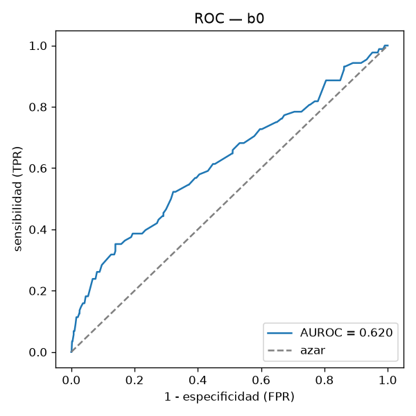
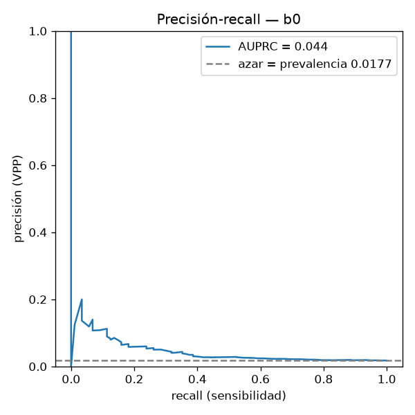
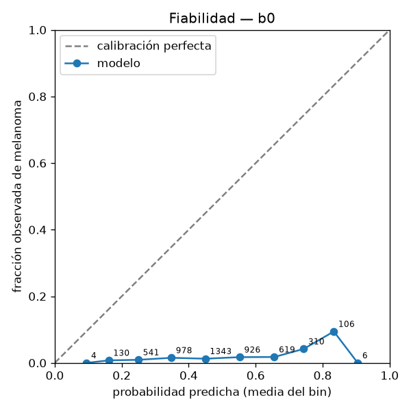

# B0 — Línea base de metadatos (sin imágenes)

Generado por `scripts/baseline_metadata.py` (commit `c1600c0`, `configs/baseline_b0.yaml`).
Regresión logística de scikit-learn sobre `age_approx`, `sex`, `anatom_site`; entrenada en `train.txt`
(22,911 imágenes, 410 melanomas) y evaluada en `val.txt`
(4,963 imágenes, 88 melanomas, 568 pacientes). Solo train y val.
SHA256 de los splits verificados contra `SHA256SUMS`: train `701333b2450c…`, val `b7f727d6cf70…`.

## Por qué existe

Responde la pregunta que hace un sinodal: **¿las imágenes aportan algo?** Edad, sexo y sitio
anatómico solos dan un AUC no trivial en ISIC 2020. B1 (F2.5) y los backbones de F3 tienen que
superar claramente estos números; un modelo de imágenes por debajo de B0 tiene un bug.

## Manejo de faltantes

Faltantes en el split de entrenamiento (F1 los cuantificó sobre el dataset completo):

| columna | faltantes | pct |
|:--|--:|--:|
| age_approx | 65 | 0.28 |
| sex | 65 | 0.28 |
| anatom_site | 444 | 1.94 |

- `age_approx`: imputación con la **median** del split de
  entrenamiento más una columna indicadora de faltante; después estandarización.
- Categóricas: categoría explícita `missing` antes del one-hot, de modo que
  "no se registró el sitio" es una categoría con su propio coeficiente.
- `class_weight=balanced`, `C=1.0`. El peso balanceado solo reescala la
  pérdida; no cambia el ordenamiento que miden AUROC y AUPRC de forma apreciable.

## Métricas sobre validación

| métrica | valor | IC 95 % (bootstrap por paciente) |
|:--|--:|:--|
| AUC-ROC | 0.620 | [0.552, 0.691] |
| AUPRC (primaria) | 0.044 | [0.028, 0.079] |
| Sensibilidad a especificidad 0.90 | 0.284 | [0.172, 0.384] |
| Sensibilidad a especificidad 0.95 | 0.182 | [0.094, 0.262] |
| Especificidad a sensibilidad 0.90 | 0.139 | [0.074, 0.225] |
| Especificidad a sensibilidad 0.95 | 0.066 | [0.034, 0.169] |
| Prevalencia (AUPRC de un clasificador aleatorio) | 0.0177 | |

Intervalos: bootstrap de 2,000 remuestreos **a nivel paciente** (semilla
20260904); remuestreos descartados por no tener ambas clases: 0.

Umbral: 0.3136 (política: sensibilidad>=0.9; la selección definitiva de umbral es de F4).

| | pred. benigno | pred. melanoma |
|:--|--:|--:|
| real benigno | 676 | 4199 |
| real melanoma | 7 | 81 |

| métrica en el umbral | valor |
|:--|--:|
| Sensibilidad | 0.920 |
| Especificidad | 0.139 |
| VPP a la prevalencia observada (0.0177) | 0.019 |
| VPN a la prevalencia observada | 0.990 |

## Coeficientes

| variable | coeficiente | odds ratio |
|:--|--:|--:|
| anatom_site_missing | -0.805 | 0.45 |
| anatom_site_oral/genital | +0.692 | 2.00 |
| age_approx | +0.625 | 1.87 |
| anatom_site_head/neck | +0.503 | 1.65 |
| missingindicator_age_approx | -0.390 | 0.68 |
| anatom_site_lower extremity | -0.320 | 0.73 |
| anatom_site_torso | -0.312 | 0.73 |
| sex_female | -0.221 | 0.80 |
| sex_male | +0.162 | 1.18 |
| anatom_site_upper extremity | +0.155 | 1.17 |
| sex_missing | -0.021 | 0.98 |
| anatom_site_palms/soles | +0.009 | 1.01 |

## Figuras

  

Predicciones por imagen en `reports/predictions/b0_val.csv`; métricas y IC en `reports/metrics/b0_val.json`.
