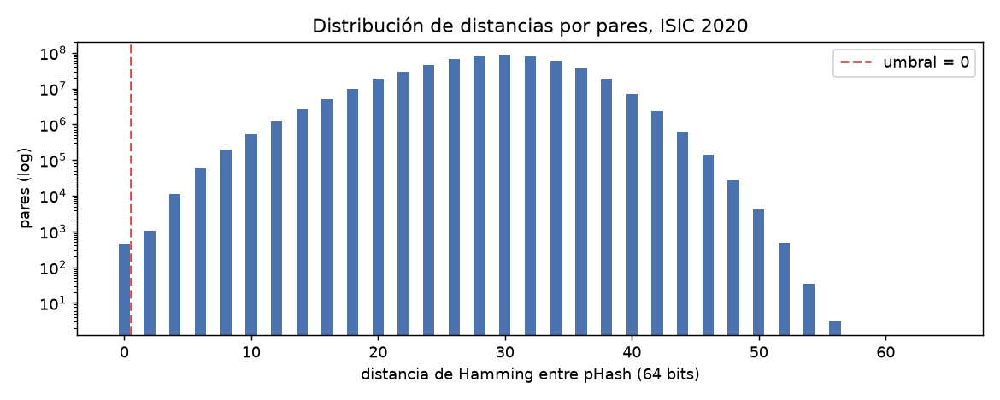

# Deduplicación ISIC 2020

Generado por `scripts/dedup_report.py`. Manifiesto: `data/manifests/isic2020.csv` (33,126 imágenes).
pHash 8x8 (64 bits), decodificación reducida a 256 px, umbral de Hamming **0** (`configs/data/isic2020.yaml`, `data.phash.threshold`).
Tiempos: hashing 0.0 min (12 procesos), 548,649,375 pares de distancias en 88 s.

## Pasada 1 — duplicados exactos (SHA256)

- Grupos con archivos byte-idénticos: **433** (intra-paciente 433, cruzados 0)
- ISIC_1188141, ISIC_6351451
- ISIC_2171314, ISIC_5791131
- ISIC_2986014, ISIC_8428997
- ISIC_0544886, ISIC_2127378
- ISIC_5941314, ISIC_8611845
- ISIC_5922139, ISIC_6740634
- ISIC_7365445, ISIC_7791770
- ISIC_2406262, ISIC_9393085
- ISIC_3526268, ISIC_3791309
- ISIC_2748736, ISIC_5481688
- ISIC_7654562, ISIC_8951006
- ISIC_6270846, ISIC_7628257
- ISIC_7644150, ISIC_8010113
- ISIC_3980006, ISIC_9354947
- ISIC_7445800, ISIC_7733258
- ISIC_5892680, ISIC_8755969
- ISIC_2792248, ISIC_9165411
- ISIC_2526675, ISIC_7743266
- ISIC_0277354, ISIC_4436810
- ISIC_2033106, ISIC_8022865
- ISIC_6696536, ISIC_6856100
- ISIC_2850155, ISIC_8546599
- ISIC_4590786, ISIC_9133072
- ISIC_3062039, ISIC_3734497
- ISIC_1350659, ISIC_8194371
- ISIC_3757997, ISIC_6676883
- ISIC_3456673, ISIC_5123837
- ISIC_0604088, ISIC_6346327
- ISIC_1594422, ISIC_2449313
- ISIC_5169650, ISIC_7385195
- … y 403 grupos más (ver `reports/dedup_pairs.csv`)

## Pasada 2 — casi-duplicados (pHash)

- Pares con distancia ≤ 0: **464**
- Grupos (componentes conexas): **452**, que abarcan 909 imágenes
  - Intra-paciente (se conservan, sin riesgo de fuga): **434**
  - Cruzados (dos o más pacientes; F1.4 los fusiona en una sola unidad de split): **18**
- Pares con al menos un melanoma: 3

### Distribución de distancias por pares

|   distancia |   pares |   acumulado |
|------------:|--------:|------------:|
|           0 |     464 |         464 |
|           1 |       0 |         464 |
|           2 |    1066 |        1530 |
|           3 |       0 |        1530 |
|           4 |   11228 |       12758 |
|           5 |       0 |       12758 |
|           6 |   57833 |       70591 |
|           7 |       0 |       70591 |
|           8 |  195295 |      265886 |
|           9 |       0 |      265886 |
|          10 |  518227 |      784113 |
|          11 |       0 |      784113 |
|          12 | 1197449 |     1981562 |
|          13 |       0 |     1981562 |
|          14 | 2546735 |     4528297 |
|          15 |       0 |     4528297 |
|          16 | 5100682 |     9628979 |

Total de pares evaluados: 548,649,375. Mediana de la distancia: 30.

### Contraste con la lista oficial `ISIC_2020_Training_Duplicates.csv`

- Pares oficiales: **425** (cruzados según `patient_id`: 0)
- Recuperados por pHash con umbral 0: **425** (100.0 %)
- Distancia pHash de los pares oficiales: mín 0, mediana 0, p90 0, máx 0
- Pares encontrados que NO están en la lista oficial: 39

### Grupos cruzados

- ISIC_1010416, ISIC_3935308
- ISIC_1039396, ISIC_9030907
- ISIC_1496111, ISIC_7912183
- ISIC_2647198, ISIC_7644573
- ISIC_2670475, ISIC_4676156
- ISIC_2690597, ISIC_7411913
- ISIC_2697895, ISIC_4591526, ISIC_5950041, ISIC_6625344
- ISIC_3996990, ISIC_9117456
- ISIC_4007215, ISIC_4026569
- ISIC_4107250, ISIC_6081985, ISIC_7145969, ISIC_8576068
- ISIC_4199101, ISIC_5707761
- ISIC_4382472, ISIC_5234835
- ISIC_4409939, ISIC_8154864, ISIC_9227253
- ISIC_4790284, ISIC_7069853
- ISIC_6260969, ISIC_6304525
- ISIC_6597839, ISIC_7164076
- ISIC_6974005, ISIC_9167290
- ISIC_8085141, ISIC_8692006

### Hojas de contactos

Hasta 20 pares por categoría, ordenados por distancia ascendente.

- Intra-paciente: `reports/figures/dedup_intra.jpg` (20 pares)
- Cruzados: `reports/figures/dedup_cross.jpg` (20 pares)

## Barrido de umbrales

Mismos pHash, distintos umbrales de Hamming (`data.phash.sweep_thresholds`). `grupos_gt_10` cuenta grupos con 10 o más imágenes; `pct_dataset` es la fracción de las 33,126 imágenes que queda dentro de algún grupo:

|   umbral |   pares |   grupos |   grupo_mayor |   grupos_gt_10 |   intra_paciente |   cruzados |   imagenes |   pct_dataset |
|---------:|--------:|---------:|--------------:|---------------:|-----------------:|-----------:|-----------:|--------------:|
|        0 |     464 |      452 |             4 |              0 |              434 |         18 |        909 |          2.74 |
|        2 |    1530 |      558 |           133 |              6 |              426 |        132 |       1617 |          4.88 |
|        4 |   12758 |      671 |          1041 |             11 |              395 |        276 |       3800 |         11.47 |
|        6 |   70591 |      699 |          6246 |              9 |              342 |        357 |       7897 |         23.84 |
|        8 |  265886 |      725 |         12394 |              1 |              274 |        451 |      13997 |         42.25 |

Desglose de los pares por distancia (`oficiales` = lista de ISIC; `cruzados` = pacientes distintos):

|   distance |   pares |   byte_identicos |   mismo_paciente |   oficiales |   cruzados |   cruzados_acum |   oficiales_acum |
|-----------:|--------:|-----------------:|-----------------:|------------:|-----------:|----------------:|-----------------:|
|          0 |     464 |              433 |              434 |         425 |         30 |              30 |              425 |
|          2 |    1066 |                0 |               12 |           0 |       1054 |            1084 |              425 |
|          4 |   11228 |                0 |               93 |           0 |      11135 |           12219 |              425 |
|          6 |   57833 |                0 |              326 |           0 |      57507 |           69726 |              425 |
|          8 |  195295 |                0 |              960 |           0 |     194335 |          264061 |              425 |
|         10 |  518227 |                0 |             2101 |           0 |     516126 |          780187 |              425 |
|         12 | 1197449 |                0 |             4306 |           0 |    1193143 |         1973330 |              425 |
|         14 | 2546735 |                0 |             7786 |           0 |    2538949 |         4512279 |              425 |
|         16 | 5100682 |                0 |            13019 |           0 |    5087663 |         9599942 |              425 |

### Inspección visual de grupos

Umbral más alto con grupo mayor < 10 imágenes: **0**. Hojas de contactos (una fila por grupo, muestreo con semilla 20260904):

- `reports/figures/dedup_groups_t0.jpg`: 10 grupos al azar entre TODOS los del umbral 0
- `reports/figures/dedup_groups_t0_no_exactos.jpg`: 10 grupos al azar del umbral 0 excluyendo pares byte-idénticos (19 grupos candidatos)
- `reports/figures/dedup_groups_t2_no_exactos.jpg`: 10 grupos al azar del umbral 2 con menos de 10 imágenes, excluyendo pares byte-idénticos (131 candidatos)

## Recomendación de umbral

Lo que muestra el barrido:

- **Umbral 0** (pHash idéntico): 464 pares, 452 grupos, el mayor de 4 imágenes. 433 grupos son los pares byte-idénticos; los otros 19 (43 imágenes) son pares con pHash igual y bytes distintos, 18 de ellos entre pacientes distintos.
- **Umbral 2**: el grupo mayor salta de 4 a 133 imágenes y aparecen 132 grupos cruzados. Ningún par oficial vive a distancia 2 (todos están a 0).
- **Umbral 4 a 8**: 1,041 → 6,246 → 12,394 imágenes en un solo grupo. A 8, el 42 % del dataset queda encadenado.

Lo que muestran las hojas de contactos:

- Los 10 grupos muestreados a distancia 0 que no son byte-idénticos son lesiones distintas (forma, color, vello y fondo diferentes) con la misma composición: mancha oscura centrada sobre fondo claro uniforme. pHash colapsa la miniatura de 32x32 a las mismas frecuencias bajas.
- Los 10 grupos muestreados a distancia 2 (de 131 candidatos con menos de 10 imágenes) son también lesiones distintas; en ninguno aparece la misma lesión con encuadre desplazado, que es lo que la pasada 2 buscaba.

**Recomendación: `data.phash.threshold = 0`**, ahora sostenida por el barrido: es el único umbral en el que el grupo mayor se mantiene por debajo de 10 imágenes, todos los pares oficiales ya están a esa distancia, y un solo paso más (2) produce encadenamiento sin recuperar ningún duplicado adicional verificable. Con umbral 0 pHash aporta 19 grupos más que SHA256; son falsos positivos visuales, pero fusionar a esos 23 pacientes en unidades de split no cuesta nada, así que se conservan como cruzados por prudencia. La consecuencia honesta es que, en ISIC 2020, la deduplicación efectiva la hace SHA256; pHash queda como verificación de que no hay casi-duplicados por recodificación (ninguno: todo par a distancia 0 con bytes distintos es una lesión distinta).

## Los 433 grupos byte-idénticos frente a los 425 de la referencia

- Tamaño de los grupos SHA256: 433 grupos de 2 → los 433 grupos son pares, es decir, 433 imágenes duplicadas y 866 implicadas.
- Lista oficial `ISIC_2020_Training_Duplicates.csv`: 425 pares (850 imágenes); 3 pares incluyen un melanoma. Por eso la referencia habla de 32,542 benignas y 32,120 sin duplicados: 32,542 − 32,120 = 422 = 425 − 3.
- Los 425 pares oficiales son todos byte-idénticos (pares oficiales no byte-idénticos: 0).
- Pares byte-idénticos que la lista oficial NO incluye: **8**. Todos con el mismo `patient_id`, el mismo `lesion_id`, metadatos idénticos y `target = 0`: el mismo archivo registrado dos veces con dos `image_id`.

| grupo                      | patient_id   | lesion_id   | mismo_lesion_id   | target   |
|:---------------------------|:-------------|:------------|:------------------|:---------|
| ISIC_2718135, ISIC_9409255 | IP_5889408   | IL_2414583  | True              | 0, 0     |
| ISIC_2074396, ISIC_8689583 | IP_5889408   | IL_6648212  | True              | 0, 0     |
| ISIC_6284722, ISIC_8262759 | IP_7651325   | IL_8087895  | True              | 0, 0     |
| ISIC_6450285, ISIC_6548307 | IP_7121757   | IL_1243658  | True              | 0, 0     |
| ISIC_7607101, ISIC_7675261 | IP_5889408   | IL_5109762  | True              | 0, 0     |
| ISIC_5492174, ISIC_6705662 | IP_4130585   | IL_1240728  | True              | 0, 0     |
| ISIC_6063252, ISIC_7195645 | IP_3564160   | IL_6590948  | True              | 0, 0     |
| ISIC_1642492, ISIC_8776686 | IP_5295861   | IL_3459064  | True              | 0, 0     |

- `lesion_id` repetidos en el manifiesto: 425. De los pares oficiales, 8 tienen `lesion_id` distinto pese a ser el mismo archivo (inconsistencia de metadatos de la fuente): [['ISIC_2754949', 'ISIC_5300278'], ['ISIC_9218360', 'ISIC_9913406'], ['ISIC_1979109', 'ISIC_9933282'], ['ISIC_1578998', 'ISIC_4139260'], ['ISIC_2138357', 'ISIC_5097912'], ['ISIC_1300006', 'ISIC_9126974'], ['ISIC_3218501', 'ISIC_7718526'], ['ISIC_6151153', 'ISIC_8329627']].

Conclusión: la diferencia son 8 pares reales que la referencia no lista, no un artefacto de conteo. La deduplicación de este proyecto usa los 433.

## Punto de verificación

La literatura reporta ~425 duplicados benignos (32,542 benignas, 32,120 sin duplicados). La lista oficial trae 425 pares; SHA256 encuentra 433 grupos byte-idénticos y pHash con umbral 0 encuentra 464 pares y recupera 425 de los oficiales.

## Pasada 3 — embeddings

**No se ejecuta.** Motivos: (1) la curación de ISIC 2020 garantiza una imagen por lesión y `lesion_id` solo se repite en los pares oficiales, que ya están cubiertos; (2) la pasada 2 muestra que en este dataset cualquier medida global de parecido produce miles de pares cruzados entre lesiones distintas, y la similitud coseno de embeddings tendría el mismo problema de precisión sin una verdad de referencia para calibrarla; (3) el costo (~3 h de CPU) no compraría un guardarraíl que los splits agrupados por paciente no den ya.
