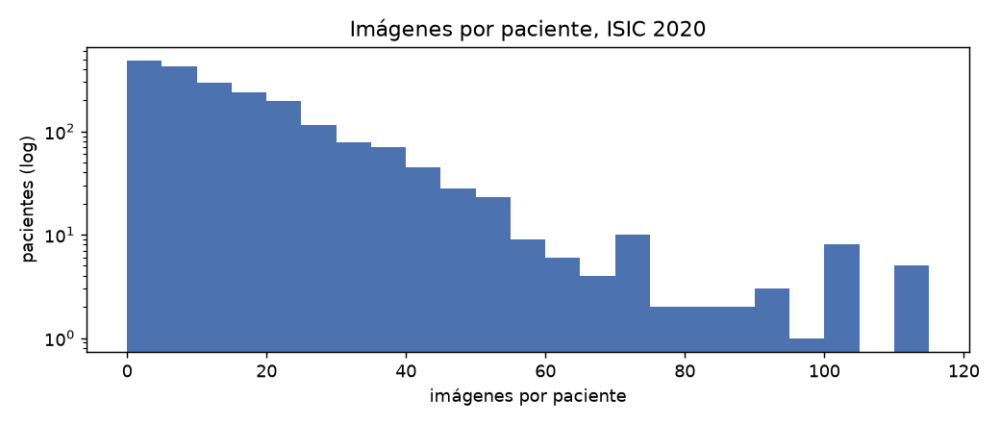
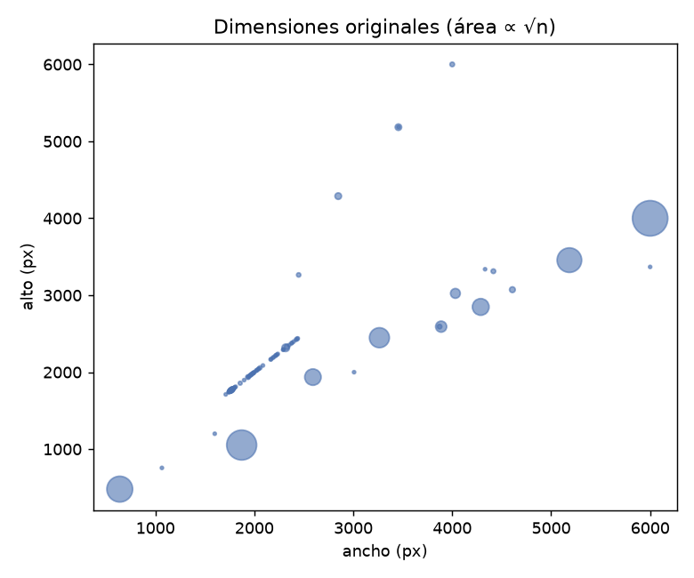

# EDA ISIC 2020 — análisis exploratorio

Generado por `scripts/eda_report.py` a partir de `data/manifests/isic2020.csv`. Solo conteos; no se hacen afirmaciones visuales sobre las clases ni juicios de viabilidad.

## 1. Distribución de clases

| clase               |   imagenes |    pct |
|:--------------------|-----------:|-------:|
| benigno (target=0)  |      32542 |  98.24 |
| melanoma (target=1) |        584 |   1.76 |
| total               |      33126 | 100    |

Por diagnóstico (`diagnosis`):

| diagnosis                          |   imagenes |   melanomas |   pct_imagenes |   prevalencia_pct |
|:-----------------------------------|-----------:|------------:|---------------:|------------------:|
| unknown                            |      27124 |           0 |          81.88 |                 0 |
| nevus                              |       5193 |           0 |          15.68 |                 0 |
| melanoma                           |        584 |         584 |           1.76 |               100 |
| seborrheic keratosis               |        135 |           0 |           0.41 |                 0 |
| lentigo NOS                        |         44 |           0 |           0.13 |                 0 |
| lichenoid keratosis                |         37 |           0 |           0.11 |                 0 |
| solar lentigo                      |          7 |           0 |           0.02 |                 0 |
| atypical melanocytic proliferation |          1 |           0 |           0    |                 0 |
| cafe-au-lait macule                |          1 |           0 |           0    |                 0 |

## 2. Imágenes por paciente

| estadistico   |   valor |
|:--------------|--------:|
| pacientes     | 2056    |
| mínimo        |    2    |
| p25           |    5    |
| mediana       |   12    |
| p75           |   22    |
| máximo        |  115    |
| media         |   16.11 |

- Pacientes con al menos un melanoma: 428 de 2,056 (20.82 %)
- Melanomas por paciente positivo: mediana 1, máximo 8

## 3. Faltantes por columna de metadatos

| columna     |   faltantes |   pct |
|:------------|------------:|------:|
| sex         |          65 |  0.2  |
| age_approx  |          68 |  0.21 |
| anatom_site |         527 |  1.59 |
| diagnosis   |           0 |  0    |

`diagnosis` no tiene vacíos, pero el valor `unknown` cubre la mayoría de las filas (ver tabla por diagnóstico arriba).

## 4. Sitio anatómico, sexo y edad

### Sitio anatómico

| anatom_site     |   imagenes |   melanomas |   pct_imagenes |   prevalencia_pct |
|:----------------|-----------:|------------:|---------------:|------------------:|
| torso           |      16845 |         257 |          50.85 |              1.53 |
| lower extremity |       8417 |         124 |          25.41 |              1.47 |
| upper extremity |       4983 |         111 |          15.04 |              2.23 |
| head/neck       |       1855 |          74 |           5.6  |              3.99 |
| (faltante)      |        527 |           9 |           1.59 |              1.71 |
| palms/soles     |        375 |           5 |           1.13 |              1.33 |
| oral/genital    |        124 |           4 |           0.37 |              3.23 |

### Sexo

| sex        |   imagenes |   melanomas |   pct_imagenes |   prevalencia_pct |
|:-----------|-----------:|------------:|---------------:|------------------:|
| male       |      17080 |         364 |          51.56 |              2.13 |
| female     |      15981 |         220 |          48.24 |              1.38 |
| (faltante) |         65 |           0 |           0.2  |              0    |

### Edad aproximada

| age_approx   |   imagenes |   melanomas |   pct_imagenes |   prevalencia_pct |
|:-------------|-----------:|------------:|---------------:|------------------:|
| 0.0          |          2 |           0 |           0.01 |              0    |
| 10.0         |         17 |           0 |           0.05 |              0    |
| 15.0         |        132 |           2 |           0.4  |              1.52 |
| 20.0         |        655 |           6 |           1.98 |              0.92 |
| 25.0         |       1544 |          16 |           4.66 |              1.04 |
| 30.0         |       2358 |          24 |           7.12 |              1.02 |
| 35.0         |       2850 |          25 |           8.6  |              0.88 |
| 40.0         |       3576 |          24 |          10.8  |              0.67 |
| 45.0         |       4466 |          54 |          13.48 |              1.21 |
| 50.0         |       4270 |          53 |          12.89 |              1.24 |
| 55.0         |       3824 |          64 |          11.54 |              1.67 |
| 60.0         |       3240 |          65 |           9.78 |              2.01 |
| 65.0         |       2527 |          70 |           7.63 |              2.77 |
| 70.0         |       1968 |          58 |           5.94 |              2.95 |
| 75.0         |        981 |          62 |           2.96 |              6.32 |
| 80.0         |        419 |          36 |           1.26 |              8.59 |
| 85.0         |        149 |           9 |           0.45 |              6.04 |
| 90.0         |         80 |          16 |           0.24 |             20    |
| (faltante)   |         68 |           0 |           0.21 |              0    |

## 5. Dimensiones originales

- Lado largo: mín 640, mediana 5184, máx 6000 px
- Megapíxeles: mín 0.3, mediana 17.9, máx 24.0
- Tamaño de archivo: mín 0.02 MB, mediana 0.84 MB, máx 3.49 MB, total 25.76 GB
- Combinaciones (ancho, alto) distintas: 88. Las 15 más frecuentes:

|   width |   height |   imagenes |   pct |
|--------:|---------:|-----------:|------:|
|    6000 |     4000 |      14703 | 44.39 |
|    1872 |     1053 |       7534 | 22.74 |
|     640 |      480 |       4147 | 12.52 |
|    5184 |     3456 |       3418 | 10.32 |
|    3264 |     2448 |       1483 |  4.48 |
|    4288 |     2848 |        729 |  2.2  |
|    2592 |     1936 |        674 |  2.03 |
|    3888 |     2592 |        140 |  0.42 |
|    4032 |     3024 |         84 |  0.25 |
|    2317 |     2317 |         29 |  0.09 |
|    2848 |     4288 |         17 |  0.05 |
|    3456 |     5184 |         16 |  0.05 |
|    4608 |     3072 |         10 |  0.03 |
|    1761 |     1761 |          7 |  0.02 |
|    1775 |     1775 |          7 |  0.02 |

## 6. Verificación de los splits

- Pacientes en más de un split: **0**
- La unión de los tres splits es exactamente el manifiesto: **sí**

| split   |   pacientes |   imagenes |   melanomas |   prevalencia_pct |
|:--------|------------:|-----------:|------------:|------------------:|
| train   |         948 |      22911 |         410 |              1.79 |
| val     |         568 |       4963 |          88 |              1.77 |
| test    |         540 |       5252 |          86 |              1.64 |

## 7. Contraste con el dataset de la versión anterior

|                              | versión anterior   | ISIC 2020 (esta versión)   |
|:-----------------------------|:-------------------|:---------------------------|
| imágenes                     | 9,625              | 33,126                     |
| melanoma (%)                 | 48 %               | 1.76 %                     |
| pacientes identificados      | no                 | sí (2,056)                 |
| split agrupado por paciente  | no                 | sí (70/15/15)              |
| conjunto de prueba bloqueado | no                 | sí (2 accesos)             |

El dataset anterior tenía la mitad de sus imágenes etiquetadas como melanoma; la prevalencia real en ISIC 2020 es de menos del 2 %. Cualquier métrica de la versión anterior se calculó sobre una distribución de clases que no corresponde a la del problema, sin agrupación por paciente y sin conjunto de prueba independiente.
