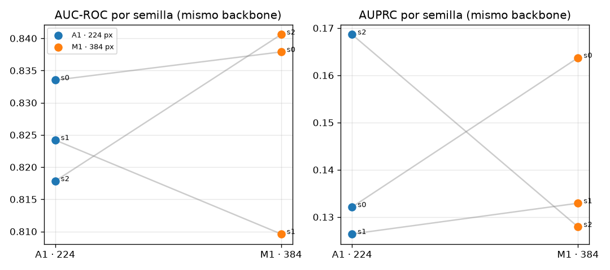

# F3 — Matriz de modelos: comparación controlada sobre validación

Generado por `scripts/f3_report.py`. Lo fijo (idéntico a B1): cabeza de la fábrica, BCE con `pos_weight` automático, AdamW 1e-4, cosine con warmup, 15 épocas con early stopping por AUPRC (paciencia 5), aumentación de F2, lado corto + CenterCrop en validación, **lote efectivo 128** (acumulación de gradiente), semillas 0/1/2, 16-mixed. Lo variable: backbone y resolución. Lo vigila `tests/test_f3_matrix.py`. el split de prueba no se toca.

## 1. Tabla principal

| config | backbone | px | semillas | AUC-ROC | AUPRC | sens@spec 0.90 | sens@spec 0.95 | spec@sens 0.90 | spec@sens 0.95 |
|:--|:--|--:|--:|:--|:--|:--|:--|:--|:--|
| **B1** | `resnet50.a1_in1k` | 224 | 3 | 0.778 (0.774–0.782) | 0.077 (0.076–0.079) | 0.402 (0.364–0.455) | 0.261 (0.239–0.284) | 0.424 (0.395–0.460) | 0.313 (0.262–0.363) |
| **A1** | `tf_efficientnetv2_s.in21k_ft_in1k` | 224 | 3 | 0.825 (0.818–0.834) | 0.142 (0.126–0.169) | 0.614 (0.568–0.659) | 0.424 (0.386–0.466) | 0.438 (0.352–0.525) | 0.327 (0.191–0.399) |
| **M1** | `tf_efficientnetv2_s.in21k_ft_in1k` | 384 | 3 | 0.829 (0.810–0.841) | 0.142 (0.128–0.164) | 0.561 (0.523–0.614) | 0.439 (0.420–0.466) | 0.454 (0.365–0.560) | 0.289 (0.224–0.400) |
| **M2** | `convnext_tiny.fb_in22k_ft_in1k_384` | 384 | 3 | 0.833 (0.828–0.840) | 0.155 (0.148–0.163) | 0.561 (0.511–0.614) | 0.428 (0.386–0.489) | 0.522 (0.501–0.541) | 0.311 (0.295–0.328) |

Media y rango (mín–máx) sobre semillas; cada corrida evaluada sobre `val.txt` con IC por paciente en su `metrics.json`.

## 2. Comparaciones aisladas

- **Efecto de la resolución, mismo backbone (224 → 384)** (M1 − A1):
  - AUC-ROC: 0.829 − 0.825 = **+0.004** → dentro del ruido (< 0.02)
  - AUPRC: 0.142 − 0.142 = **-0.001** → dentro del ruido (< 0.02)
  - spec@sens 0.90: 0.454 − 0.438 = **+0.015** → dentro del ruido (< 0.02)
- **Efecto de la arquitectura a 224 px (ResNet50 → EfficientNetV2-S)** (A1 − B1):
  - AUC-ROC: 0.825 − 0.778 = **+0.047** → supera 0.02
  - AUPRC: 0.142 − 0.077 = **+0.065** → supera 0.02
  - spec@sens 0.90: 0.438 − 0.424 = **+0.014** → dentro del ruido (< 0.02)
- **Efecto de la arquitectura a 384 px (EfficientNetV2-S → ConvNeXt-T)** (M2 − M1):
  - AUC-ROC: 0.833 − 0.829 = **+0.004** → dentro del ruido (< 0.02)
  - AUPRC: 0.155 − 0.142 = **+0.014** → dentro del ruido (< 0.02)
  - spec@sens 0.90: 0.522 − 0.454 = **+0.069** → supera 0.02

Umbral: diferencias de medias menores que 0.02 no distinguen nada (dos ejecuciones de la misma semilla difirieron 0.016 de AUC-ROC en F2).

## 3. Ablación de resolución por semilla

## 4. Tiempos y utilización de GPU

| corrida | commit | épocas (mejor) | min entrenamiento | min/época | espera de datos | GPU media | colapso |
|:--|:--|:--|--:|--:|--:|--:|:--|
| `resnet50-224-s0-f431f11` | `f431f11` | 11 (5) | 22 | n/d | n/d | n/d | no |
| `resnet50-224-s1-bcdbbf9` | `bcdbbf9` | 12 (6) | 24 | n/d | n/d | n/d | no |
| `resnet50-224-s2-bcdbbf9` | `bcdbbf9` | 13 (7) | 26 | n/d | n/d | n/d | no |
| `tf_efficientnetv2_s-224-s0-e153979` | `e153979` | 10 (4) | 24 | 2.3 | 0 % | 100 % | no |
| `tf_efficientnetv2_s-224-s1-e153979` | `e153979` | 14 (8) | 33 | 2.3 | 0 % | 99 % | no |
| `tf_efficientnetv2_s-224-s2-e153979` | `e153979` | 15 (12) | 34 | 2.2 | 0 % | 100 % | no |
| `tf_efficientnetv2_s-384-s0-d294744` | `d294744` | 15 (12) | 95 | 6.2 | 29 % | 99 % | no |
| `tf_efficientnetv2_s-384-s1-e153979` | `e153979` | 15 (11) | 101 | 6.6 | 29 % | 99 % | no |
| `tf_efficientnetv2_s-384-s2-e153979` | `e153979` | 11 (5) | 73 | 6.5 | 29 % | 99 % | no |
| `convnext_tiny-384-s0-e153979` | `e153979` | 15 (11) | 82 | 5.4 | 46 % | 99 % | no |
| `convnext_tiny-384-s1-e153979` | `e153979` | 15 (12) | 95 | 6.2 | 46 % | 98 % | no |
| `convnext_tiny-384-s2-e153979` | `e153979` | 15 (9) | 95 | 6.3 | 46 % | 99 % | no |

Espera de datos: fracción del tiempo del bucle de entrenamiento que el DataLoader tiene a la GPU ociosa (`ThroughputMonitor`). Por debajo de ~70 % de GPU se documenta y se considera más `num_workers` o un redimensionado previo (F3.4).

## 5. Colapsos

Ninguno.

## 6. Regla de decisión (F3.5) aplicada

Orden por AUPRC medio y luego especificidad a sensibilidad 0.90:

- M2: AUPRC 0.155, spec@sens0.90 0.522, AUC-ROC 0.833, costo CPU relativo 13.1
- A1: AUPRC 0.142, spec@sens0.90 0.438, AUC-ROC 0.825, costo CPU relativo 2.9
- M1: AUPRC 0.142, spec@sens0.90 0.454, AUC-ROC 0.829, costo CPU relativo 8.4
- B1: AUPRC 0.077, spec@sens0.90 0.424, AUC-ROC 0.778, costo CPU relativo 4.1

Empate (ΔAUC-ROC y ΔAUPRC < 0.02) entre M2, A1, M1: gana la más barata de servir, **A1**.

## 7. Anclaje en la literatura (F3.6)

Verificado en la fuente el 2026-09-17 (texto completo en ar5iv y resumen en Semantic Scholar).

| referencia | AUC-ROC declarado | sobre qué conjunto | modelos | resoluciones | metadatos | datos externos | TTA |
|:--|:--|:--|:--|:--|:--|:--|:--|
| Ha, Liu y Liu (2020), *Identifying Melanoma Images using EfficientNet Ensemble: Winning Solution to the SIIM-ISIC Melanoma Classification Challenge*, arXiv:2010.05351, <https://doi.org/10.48550/arXiv.2010.05351> | «0.9600 AUC on cross validation and 0.9490 AUC on private leaderboard» | validación cruzada de 5 pliegues sobre 2018+2019+2020 combinados, y leaderboard privado del reto | ensamble de **18 modelos** (EfficientNet B3–B7, SE-ResNeXt-101, ResNeSt-101) | 384, 448, 512, 576, 640, 768 y 896 | sí, en 4 de los 18 (sexo, edad, sitio anatómico, tamaño de imagen, n_images) | sí: ISIC 2018 y 2019 junto con 2020 | no se menciona en el texto consultado |
| Cassidy, Kendrick, Brodzicki, Jaworek-Korjakowska y Yap (2022), *Analysis of the ISIC image datasets: Usage, benchmarks and recommendations*, Medical Image Analysis 75, 102305, <https://doi.org/10.1016/j.media.2021.102305> | «an AUC of 0.80 for the best performing model» | conjunto de prueba de ISIC 2020, tras eliminar 14,310 duplicados del entrenamiento y balancear | modelos únicos (varias arquitecturas; el resumen no las nombra) | no indicado en el resumen | no | no («our aim was not to maximise network performance») | no |

Lectura: el ganador del reto es un ensamble de 18 redes grandes a resoluciones de hasta 896 px, con datos de tres años y metadatos en parte de los modelos. Un modelo único sin datos externos, sin TTA y sin metadatos, entrenado con la cuota gratuita de Kaggle, queda por diseño varios puntos por debajo; la referencia de modelo único de Cassidy et al. (0.80 en el test de ISIC 2020) es el punto de comparación más cercano a este pipeline, con la salvedad de que aquí se evalúa sobre un split de validación por paciente y no sobre el test del reto.

**Situación de A1:** AUC-ROC medio de 0.825 sobre validación (por paciente, 88 melanomas). Está muy por debajo del 0.949 del ganador en el leaderboard privado, y eso es lo esperable: aquel número sale de 18 modelos de hasta 896 px, con ISIC 2018 y 2019 añadidos al entrenamiento y metadatos en parte del ensamble; aquí hay un modelo único a 224 px, sin datos externos, sin metadatos, sin TTA y con unas 12 h de GPU gratuita para toda la matriz. Frente al modelo único de Cassidy et al. (0.80 en el test de ISIC 2020 tras eliminar duplicados), A1 queda por encima, con la salvedad de que los conjuntos de evaluación no son el mismo.

## 8. Modelo final para F4 (F3.7)

- **Configuración:** A1 (`tf_efficientnetv2_s.in21k_ft_in1k` a 224 px), experimento `a1`.
- **Checkpoint:** el de semilla 0, fijado antes de mirar los resultados (elegir la mejor semilla sería seleccionar sobre validación).
- **Archivo:** `tf_efficientnetv2_s-224-s0-e153979-04-0.0000.ckpt` (232 MB), SHA256 `e0ecf981adaa125dd707d2e5e3b75cff003335e56aaa7356fca9e961d4710040`.
- **Corrida:** `tf_efficientnetv2_s-224-s0-e153979`, commit `e153979`, AUC-ROC 0.834, AUPRC 0.132.
- **Publicado en Kaggle:** `edgaronti26/melanoma-f3-final` (2026-09-18), SHA256 verificado `e0ecf981adaa125d…`.
