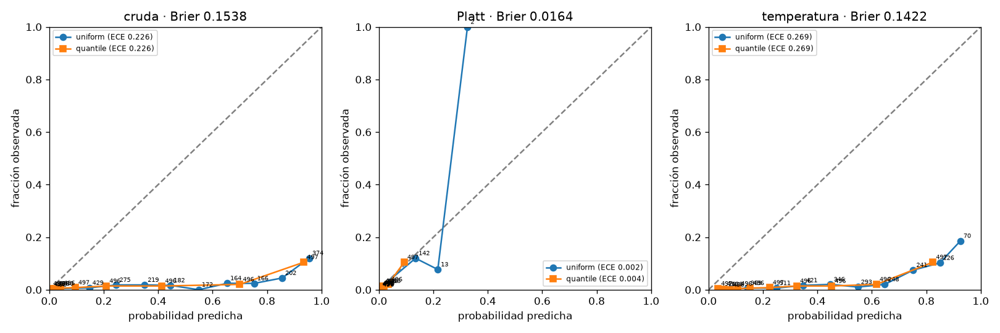
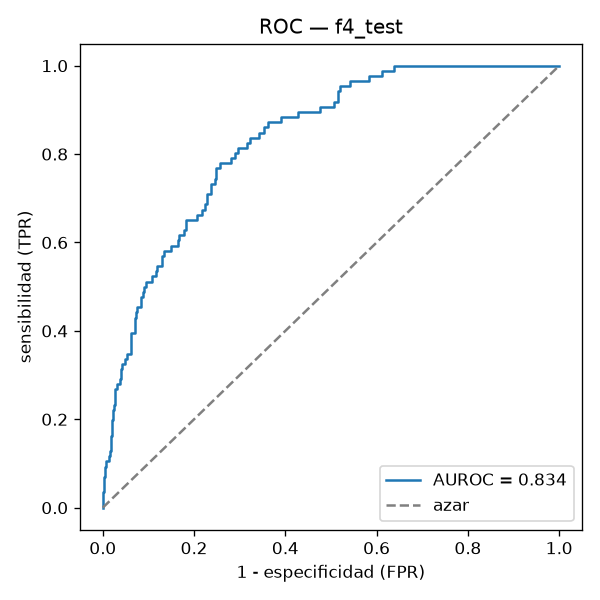
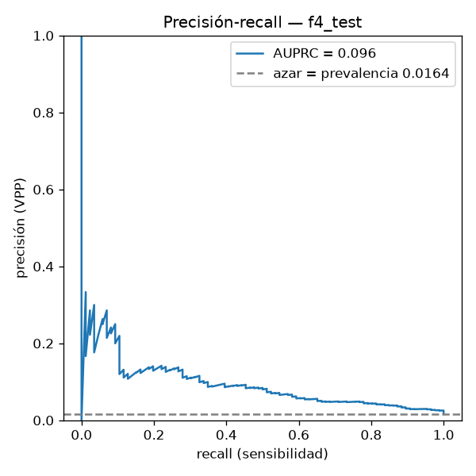
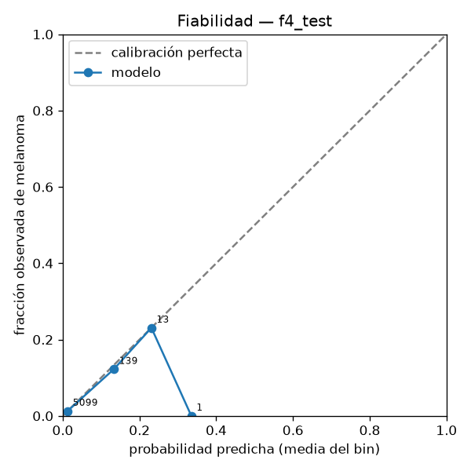

# F4 — Evaluación clínica

Generado por `scripts/f4_report.py`. Modelo: A1 (`tf_efficientnetv2_s.in21k_ft_in1k` a 224 px, semilla 0), checkpoint `melanoma-f3-final`. Nada de esta fase cambia el modelo.

## 1. Protocolo congelado

`docs/f4_protocol.yaml`, commiteado en `23d817a 2026-09-18 15:48:29 -0600`, antes del script de evaluación del test. Copia literal:

```yaml
# F4.3 — Protocolo congelado de la evaluación clínica.
# Escrito y commiteado ANTES de que exista scripts/evaluate_test.py y antes de leer test.txt.
# Todo lo de aquí se decidió sobre validación (reports/f4_calibration.json, commit 2822128).
# Nada se reajusta después de ver el test. scripts/evaluate_test.py se niega a correr si este
# archivo tiene cambios sin commitear (tests/test_f4_protocol.py::test_protocol_committed).
frozen_on: "2026-09-18"
decided_on: val   # split de validación (4,963 imágenes, 88 melanomas, 568 pacientes)

model:
  experiment: a1            # EfficientNetV2-S a 224 px, semilla 0 (F3.7)
  backbone: tf_efficientnetv2_s.in21k_ft_in1k
  image_size: 224
  val_resize: center_crop   # lado corto a 224 + CenterCrop, como en validación
  checkpoint_file: tf_efficientnetv2_s-224-s0-e153979-04-0.0000.ckpt
  checkpoint_sha256: e0ecf981adaa125dd707d2e5e3b75cff003335e56aaa7356fca9e961d4710040
  train_run_git_sha: e153979   # commit con el que se entrenó a1-s0
  git_sha_calibration: 7377047   # commit con el que se calibró
  pos_weight_used: 54.88

calibration:
  method: platt             # primaria; corrige escala y desplazamiento (pos_weight)
  a: 0.4845898727556983
  b: -3.8073929308826067
  expected_b: -4.00514898341763   # -ln(pos_weight); observado b ≈ expected_b - 0.2
  fitted_on: val
  secondary:
    method: temperature
    T: 1.8304953959638577

thresholds:
  method: "bootstrap-median, 2000 resamples, patient-level, on Platt-calibrated probabilities"
  seed: 20260904
  tau_95: 0.0038890622237550752       # mediana; p5 0.001330, p95 0.006301; corte único 0.003889
  tau_90: 0.006630038044694367       # mediana; p5 0.004008, p95 0.011222; corte único 0.006301
  on_val:
    tau_95: {sensitivity: 0.9545, specificity: 0.4000, ppv: 0.0279, npv: 0.9980}
    tau_90: {sensitivity: 0.8977, specificity: 0.5374, ppv: 0.0338, npv: 0.9966}

metrics:
  - auroc
  - auprc
  - sens_at_spec_090
  - sens_at_spec_095
  - spec_at_sens_090
  - spec_at_sens_095
  - ece            # 10 bins uniformes y 10 por cuantiles, con la calibración congelada
  - brier
  - confusion_at_tau_95
  - confusion_at_tau_90
ppv_npv_projection_prevalences: [0.01, 0.02, 0.05]

bootstrap:
  n: 2000
  unit: patient
  seed: 20260904
  ci: 0.95

subgroups:   # exploratorio: 86 melanomas en test, 5–30 por subgrupo; IC anchos
  age: ["<40", "40-59", "60+", "unknown"]     # age_approx: <40, 40–59, ≥60, NaN
  sex: [male, female, unknown]
  site: [as_in_manifest, unknown]             # anatom_site del manifiesto + faltante
  reference_rule: "no se concluye nada de una diferencia cuyo IC cruce el del grupo de referencia"

test_access:
  budget_total: 2
  used_by_this_phase: 1
  log: logs/test_set_access.log

ddi:
  primary_task: malignant_vs_benign      # etiqueta de DDI; cambio de tarea, se declara
  secondary_task: melanoma_vs_rest       # disease contiene "melanoma"
  groups: [fst_12, fst_34, fst_56]       # skin_tone 12 / 34 / 56
  bootstrap_unit: image                  # DDI no tiene id de paciente; limitación declarada
  preprocessing: same_as_val             # lado corto + CenterCrop 224; no se adapta a DDI
  calibration: isic_platt_as_is          # se aplica la de ISIC y se reporta el ECE
  runs_on: local_cpu                     # DDI no sale de la laptop
  anchor: "Daneshjou et al. 2022, Sci Adv 8(31):eabq6147, doi:10.1126/sciadv.abq6147"
```

## 2. Bitácora del acceso al test

```
2026-09-18T22:10:55+00:00	git=be931a6	protocol_sha256=8c45394e1219d67706076ec9a407427b15616386635b7df52be1969637515e93	split=test	reason=F4.4 evaluación clínica (primer acceso)
```
1 línea(s) en `logs/test_set_access.log` (presupuesto: 2).

## 3. Calibración sobre validación

Ajustadas sobre validación (4,963 imágenes, 88 melanomas, 568 pacientes), commit `7377047`.

| probabilidades | Brier | ECE (10 bins uniformes) | ECE (10 bins por cuantiles) |
|:--|--:|--:|--:|
| crudas (sigmoide del logit) | 0.1538 | 0.2258 | 0.2261 |
| temperatura T = 1.830 | 0.1422 | 0.2692 | 0.2692 |
| Platt a = 0.485, b = -3.807 (primaria) | 0.0164 | 0.0016 | 0.0041 |

**Verificación teórica de `b`:** con `pos_weight` = 54.88, se esperaba b ≈ −ln(54.88) = -4.005; Platt dio b = -3.807 (diferencia +0.198). La pendiente a = 0.485 < 1 es la sobreconfianza habitual de la red, que la temperatura sola (T = 1.83) corrige en escala pero no en desplazamiento: por eso Platt reduce el Brier de 0.1538 a 0.0164 y la temperatura apenas a 0.1422.
El orden se preserva (AUC-ROC idéntico antes y después: True). Bins uniformes ocupados tras Platt: 4 de 10 (el primero concentra 4,806 imágenes); por eso se reportan también los bins por cuantiles.



### Umbrales por bootstrap (F4.2)

| umbral | mediana (bootstrap) | p5 | p95 | corte único | sens (val) | spec (val) | VPP (val) | VPN (val) |
|:--|--:|--:|--:|--:|--:|--:|--:|--:|
| tau_95 | 0.0039 | 0.0013 | 0.0063 | 0.0039 | 0.955 | 0.400 | 0.028 | 0.9980 |
| tau_90 | 0.0066 | 0.0040 | 0.0112 | 0.0063 | 0.898 | 0.537 | 0.034 | 0.9966 |

Sobre probabilidades calibradas con Platt; 2,000 remuestreos por paciente. Con 88 melanomas, sensibilidad ≥ 0.95 son 84 aciertos: el umbral de un corte depende de cuatro casos, la mediana no.

## 4. Resultados sobre el test

| métrica | test (IC 95 % por paciente) |
|:--|:--|
| AUC-ROC | 0.834 [0.795, 0.872] |
| AUPRC | 0.096 [0.065, 0.154] |
| sensibilidad a especificidad 0.90 | 0.512 [0.404, 0.613] |
| sensibilidad a especificidad 0.95 | 0.337 [0.239, 0.438] |
| especificidad a sensibilidad 0.90 | 0.524 [0.455, 0.695] |
| especificidad a sensibilidad 0.95 | 0.481 [0.377, 0.618] |
| ECE uniforme / cuantiles (Platt congelada) | 0.0006 / 0.0039 (crudas: 0.2103) |
| Brier (Platt congelada) | 0.0155 (crudas: 0.1434) |
| prevalencia observada | 0.0164 (86 de 5,252, 540 pacientes) |

  

## 5. Punto de operación

**τ95 = 0.0039**

| | pred. benigno | pred. melanoma |
|:--|--:|--:|
| real benigno | 2213 | 2953 |
| real melanoma | 3 | 83 |

sensibilidad 0.965 · especificidad 0.428 · VPP 0.027 · VPN 0.9986 a la prevalencia observada (0.0164)

**τ90 = 0.0066**

| | pred. benigno | pred. melanoma |
|:--|--:|--:|
| real benigno | 2938 | 2228 |
| real melanoma | 9 | 77 |

sensibilidad 0.895 · especificidad 0.569 · VPP 0.033 · VPN 0.9969 a la prevalencia observada (0.0164)

**Proyección de τ95 a otras prevalencias** (aritmética desde sensibilidad y especificidad del test):

| prevalencia | VPP | VPN | fracción referida |
|--:|--:|--:|--:|
| 1 % | 0.017 | 0.9992 | 0.576 |
| 2 % | 0.033 | 0.9983 | 0.579 |
| 5 % | 0.082 | 0.9957 | 0.591 |

## 6. Validación vs test

| métrica | validación (gastada) | test (limpio) | brecha |
|:--|--:|--:|--:|
| AUC-ROC | 0.834 | 0.834 | +0.000 |
| AUPRC | 0.132 | 0.096 | -0.036 |
| spec@sens 0.90 | 0.525 | 0.524 | -0.001 |
| spec@sens 0.95 | 0.400 | 0.481 | +0.081 |

**Advertencia de selección.** Sobre validación se eligieron la línea base, el desbalance, la arquitectura, la resolución, la época de cada corrida, la calibración y el umbral; sus métricas están sesgadas al alza. El test es la única estimación limpia; una brecha negativa es la brecha de generalización, no un bug.

## 7. Subgrupos (exploratorio)

| dimensión | grupo | n | melanomas | AUC-ROC [IC] | sens@τ95 | spec@τ95 |
|:--|:--|--:|--:|:--|--:|--:|
| age | 40-59 | 2661 | 32 | 0.780 [0.704, 0.855] | 0.938 | 0.446 |
| age | 60+ | 1668 | 42 | 0.858 [0.816, 0.898] | 0.976 | 0.436 |
| age | <40 | 920 | 12 | 0.857 [0.761, 0.933] | 1.000 | 0.366 |
| age | unknown | 3 | 0 | n/d [n/d, n/d] | n/d | 0.000 |
| sex | female | 2506 | 35 | 0.823 [0.760, 0.881] | 0.971 | 0.472 |
| sex | male | 2746 | 51 | 0.841 [0.792, 0.886] | 0.961 | 0.388 |
| site | head/neck | 294 | 7 | 0.875 [0.748, 0.975] | 1.000 | 0.272 |
| site | lower extremity | 1354 | 22 | 0.817 [0.739, 0.888] | 0.955 | 0.458 |
| site | oral/genital | 20 | 1 | 0.789 [0.647, 1.000] | 1.000 | 0.053 |
| site | palms/soles | 66 | 0 | n/d [n/d, n/d] | n/d | 0.318 |
| site | torso | 2695 | 39 | 0.848 [0.790, 0.899] | 0.949 | 0.439 |
| site | unknown | 35 | 1 | 1.000 [1.000, 1.000] | 1.000 | 0.382 |
| site | upper extremity | 788 | 16 | 0.807 [0.708, 0.894] | 1.000 | 0.421 |

**Exploratorio.** Con 86 melanomas en test, los subgrupos tienen entre 5 y 30 positivos y los intervalos son anchos: este análisis detecta diferencias grandes, no confirma diferencias pequeñas. No se concluye nada de una diferencia cuyo intervalo cruce el del grupo de referencia.

## 8. Evaluación externa en DDI

Corrido en local, en CPU, el 2026-09-18 (commit `23d817a`, checkpoint `e0ecf981adaa125d…`). 656 imágenes clínicas con biopsia; 171 malignas (26 %); 21 melanomas en `disease` (melanoma, melanoma-acral-lentiginous, melanoma-in-situ, nodular-melanoma-(nm)). Misma transformación que validación (lado corto + CenterCrop 224), calibración Platt de ISIC tal cual, umbral τ95 de ISIC tal cual. Bootstrap a nivel imagen: DDI no tiene id de paciente (limitación declarada).

**Dos cambios a la vez, declarados:** dermatoscopía → foto clínica, y melanoma-vs-resto → maligno-vs-benigno (78 diagnósticos). La tarea primaria es un cambio de tarea respecto al entrenamiento.

| tarea | grupo | n | positivos | AUC-ROC [IC] | AUPRC | sens@τ95 | spec@τ95 |
|:--|:--|--:|--:|:--|--:|--:|--:|
| maligno vs benigno (primaria) | todas | 656 | 171 | 0.596 [0.541, 0.648] | 0.367 | 1.000 | 0.010 |
|  | FST I–II | 208 | 49 | 0.590 [0.494, 0.678] | 0.326 | 1.000 | 0.006 |
|  | FST III–IV | 241 | 74 | 0.596 [0.512, 0.676] | 0.449 | 1.000 | 0.012 |
|  | FST V–VI | 207 | 48 | 0.604 [0.506, 0.702] | 0.353 | 1.000 | 0.013 |
| melanoma vs resto (secundaria) | todas | 656 | 21 | 0.532 [0.408, 0.657] | 0.037 | 1.000 | 0.008 |
|  | FST I–II | 208 | 7 | 0.461 [0.291, 0.635] | 0.033 | 1.000 | 0.005 |
|  | FST III–IV | 241 | 7 | 0.437 [0.139, 0.737] | 0.045 | 1.000 | 0.009 |
|  | FST V–VI | 207 | 7 | 0.712 [0.496, 0.856] | 0.071 | 1.000 | 0.010 |

**Calibración de ISIC aplicada a DDI:** ECE uniforme 0.229, Brier 0.242. Con prevalencia 15 veces mayor y otro dominio, la calibración no se transfiere: es un resultado, no un error. El umbral τ95 de ISIC refiere casi todo (especificidad 0.010): fuera del dominio el punto de operación tampoco vale.

**Anclaje (verificado en fuente el 2026-09-18, texto completo en PMC9374341):** Daneshjou, R., Vodrahalli, K., Liang, W., Novoa, R. A., Jenkins, M., Rotemberg, V., Ko, J., Swetter, S. M., Bailey, E. E., Gevaert, O., Mukherjee, P., Phung, M., Yekrang, K., Fong, B., Sahasrabudhe, R., Zou, J., Chiou, A. S. (2022). *Disparities in dermatology AI performance on a diverse, curated clinical image set.* Science Advances, 8(31), eabq6147. <https://doi.org/10.1126/sciadv.abq6147>. Sobre las mismas 656 imágenes (208 / 241 / 207 por grupo, con 49 / 74 / 48 malignas), tres algoritmos del estado del arte cayeron de 0.88–0.94 en sus conjuntos originales a «ModelDerm had an ROC-AUC of 0.65 [95% confidence interval (CI), 0.61 to 0.70], DeepDerm had an ROC-AUC of 0.56 (0.51 to 0.61), and HAM10000 had an ROC-AUC of 0.67 (95% CI, 0.62 to 0.71)», con peor desempeño en FST V–VI (por ejemplo HAM10000: 0.72 en FST I–II frente a 0.57 en FST V–VI).

**Situación de este modelo:** AUC-ROC 0.596 [0.541, 0.648] en maligno vs benigno, dentro del rango 0.56–0.67 de los tres algoritmos del paper y en el extremo bajo, como corresponde a un modelo entrenado solo en dermatoscopía de ISIC 2020 y sin fotos clínicas. Por tono: 0.590 / 0.596 / 0.604 (I–II / III–IV / V–VI), con intervalos que se traslapan por completo: este modelo **no** muestra la caída en piel oscura que reporta el paper. Con 48–74 positivos por grupo el intervalo de cada AUC mide ±0.09, así que lo que puede decirse es que no hay una diferencia grande, no que no haya ninguna; y un modelo que discrimina poco en todos los grupos tiene poco margen para discriminar peor en uno. Melanoma vs resto (21 positivos, 7 por grupo) no permite concluir nada.

## 9. Comparación con la v1

| | v1 (2024) | v2 (este trabajo) |
|---|---|---|
| Conjunto reportado | Validación, contaminada | Test bloqueado, un acceso |
| Prevalencia | 48 % | 1.64 % |
| Métrica principal | Accuracy 90.39 % | AUC-ROC y AUPRC con IC |
| Umbral | 0.5 por omisión | τ95 por bootstrap sobre validación |
| Calibración | Ninguna | Platt sobre validación |
| Fugas verificadas | No | Sí, por paciente |
| Sesgo por tono de piel | No evaluado | DDI, tres grupos |
| Dominio fuera de dermatoscopía | Una foto sin diagnóstico | 656 imágenes con biopsia |

## 10. Limitaciones

_pendiente: las escribe Edgar en `docs/f4_limitations.md`_
