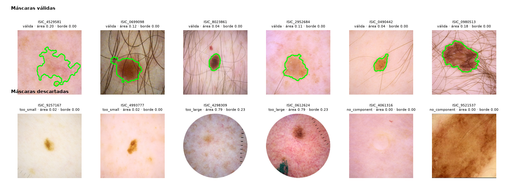
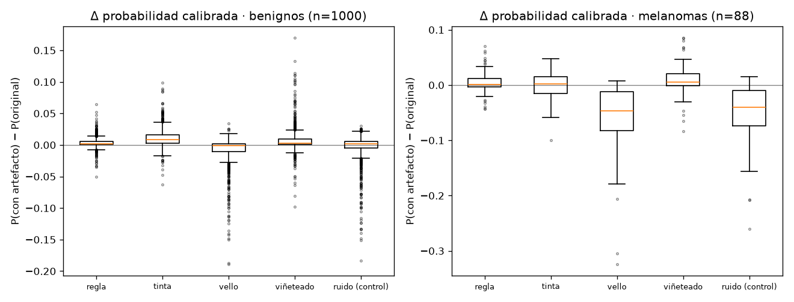
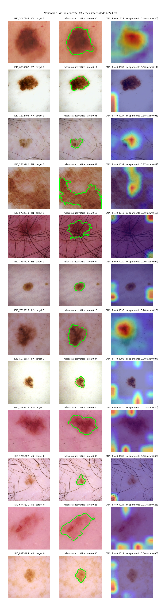
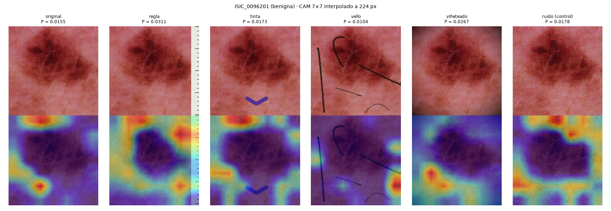

# F5 — Explicabilidad: Grad-CAM validado sobre validación

_Generado por `scripts/f5_report.py` el 2026-09-21. Modelo final de F3 (A1), calibración y τ95 de F4 congelados. Todo sobre el split de validación (4963 imágenes, 88 melanomas); el conjunto de prueba no se abre. Sin imágenes de DDI._

## 1. Método y capa

**Modelo:** A1, `tf_efficientnetv2_s.in21k_ft_in1k` a 224 px, semilla 0, checkpoint de F3 `tf_efficientnetv2_s-224-s0-e153979-04-0.0000.ckpt` (SHA256 `e0ecf981adaa125d…`). Cabeza: pooling global promedio → dropout → lineal de una salida (logit de melanoma).

**Método:** Grad-CAM (Selvaraju et al., 2017) sobre la última etapa convolucional antes del pooling: `backbone.bn2` de timm, es decir, la salida de `conv_head` (1×1, 256 → 1280 canales) tras BatchNorm y SiLU. Es exactamente el tensor que entra al pooling global. A 224 px y stride total 32 el mapa mide **7 × 7** (1280 canales) y se interpola bilinealmente a 224 × 224 para superponerlo.

**Equivalencia con CAM.** Con la cabeza GAP + lineal, ∂logit/∂A_k(x, y) = w_k / (H·W) para toda posición, así que los pesos de Grad-CAM (promedio espacial del gradiente) son w_k / 49 y, tras normalizar al máximo, el mapa es idéntico al CAM de Zhou et al. (2016): `ReLU(Σ_k w_k · A_k(x, y))`. La implementación del proyecto (`melanoma.explain.cam_from_features`) no usa gradientes ni torch: recibe los mapas `[1280, 7, 7]` y los 1280 pesos de la capa lineal. La sección 2 verifica numéricamente la equivalencia. Contrato para F6: `explain(features[1280, 7, 7], linear_weight[1280]) → [7, 7]` con valores en [0, 1] y máximo 1; `upsample(cam, size) → [size, size]` bilineal (numpy puro, verificado contra `torch.nn.functional.interpolate`).

**Limitaciones del método, declaradas de antemano:**

- **Resolución.** Una malla de 7 × 7 sobre 224 px: cada celda cubre 32 × 32 px de la entrada (≈ 6.5 % del lado). El mapa no puede señalar estructuras finas (red pigmentaria, puntos, estrías); señala regiones. Es una limitación de la resolución del mapa, no del modelo.
- **Solo evidencia positiva.** Con un único logit, la ReLU conserva únicamente las celdas que empujan hacia «melanoma». Las regiones que empujan hacia «benigno» quedan en cero: el mapa no explica por qué el modelo descarta una lesión, solo dónde ve evidencia a favor de referirla.
- **Mapas vacíos.** En **181 de 4963** imágenes de validación (3.6 %) ninguna celda es positiva y el mapa es cero en todas partes (ninguna de ellas es melanoma: son benignos con logit muy negativo). F6 debe tratar ese caso como «sin evidencia positiva», no como un mapa uniforme.

## 2. Equivalencia Grad-CAM ≡ CAM

Sobre 50 imágenes de validación elegidas al azar (semilla 20260904), la CAM en numpy interpolada a 224 px se comparó con la salida de `pytorch-grad-cam` (`GradCAM`, capa `backbone.bn2`, objetivo = el logit) mediante la correlación de Pearson por imagen. Criterio fijado en la spec: > 0.99.

| imágenes | con correlación definida | ambas cero | correlación mínima | media | mediana | criterio |
|--:|--:|--:|--:|--:|--:|:--|
| 50 | 48 | 2 | 1.000000 | 1.000000 | 1.000000 | **verificada** |

En las 2 imágenes «ambas cero» ninguna celda es positiva, los dos métodos devuelven un mapa nulo y la correlación no está definida; coinciden trivialmente. En el resto la correlación es 1 hasta la precisión de coma flotante: no hay error de capa ni de signo, y la API de F6 puede calcular el mapa sin PyTorch.

Además, `tests/test_explain.py::test_cam_equals_gradcam` repite la comparación en CI con el mismo backbone (pesos aleatorios) sobre imágenes sintéticas.

## 3. Prueba de cordura (Adebayo et al., 2018)

Prueba de aleatorización de parámetros: sobre 200 imágenes de validación al azar se calcula el CAM con el modelo entrenado y con copias en las que se reinicializan los pesos (`reset_parameters` de torch: Kaiming uniforme en convoluciones y lineal, BatchNorm a peso 1 / sesgo 0 / estadísticas 0 y 1), en tres ámbitos en cascada: la cabeza, la cabeza más el último bloque, y todo. Se reporta la correlación de Spearman entre el mapa entrenado y el aleatorio, celda a celda sobre la malla 7 × 7, con 3 semillas por ámbito. **Umbral declarado de antemano (spec F5.2): correlación < 0.3.** Las parejas donde uno de los dos mapas es constante (normalmente el aleatorio, todo cero) no tienen correlación definida y se cuentan aparte.

| ámbito reinicializado | semillas | Spearman media | mediana | p05 | p95 | < 0.3 | indefinidas |
|:--|--:|--:|--:|--:|--:|--:|--:|
| cabeza (lineal + `conv_head` + `bn2`) | 3 | -0.154 | -0.166 | -0.543 | 0.297 | 95 % | 60 / 600 |
| cabeza + último bloque (`blocks[-1]`) | 3 | -0.004 | -0.003 | -0.272 | 0.289 | 96 % | 15 / 600 |
| todos los pesos | 3 | 0.072 | 0.080 | -0.326 | 0.439 | 82 % | 120 / 600 |

Todas las medias quedan muy por debajo de 0.3 (la mayor es 0.072): el mapa depende de los pesos, no solo de la imagen. **La prueba se pasa.**

Esto coincide con lo que Adebayo et al. reportan para Grad-CAM («Of the methods we tested, Gradients & GradCAM pass the sanity checks, while Guided BackProp & Guided GradCAM fail») y es lo esperable por construcción: con la equivalencia de la sección 1, el CAM es una combinación lineal de los mapas de activación con los pesos de la capa lineal, y reinicializar cualquiera de los dos lo cambia. `tests/test_explain.py::test_cam_depends_on_weights` vigila la propiedad en CI con una imagen sintética.

## 4. Solapamiento del CAM con la lesión

**Máscara automática.** Escala de grises del recorte de 224 px que ve el modelo → desenfoque gaussiano 5 × 5 → umbral de Otsu (la lesión es la parte oscura) → apertura y cierre morfológicos (elipse de 7 px) → componente conexa más grande que no toque más del 30 % del perímetro y que alcance el cuadrado central de la imagen (25–75 % de cada lado; sin esta condición una esquina oscura de viñeta ganaba a una lesión pequeña en las primeras corridas). Filtro de calidad: área entre 3 % y 70 % de la imagen. Es una máscara cruda, sin aprendizaje, y se declara como tal.

| imágenes de validación | máscara válida | descartadas: componente < 3 % | descartadas: > 70 % | descartadas: sin componente |
|--:|--:|--:|--:|--:|
| 4963 | **4161** (83.8 %) | 581 | 17 | 204 |



Ejemplos (`image_id`): `ISIC_4529581`, `ISIC_0699098`, `ISIC_8023861`, `ISIC_2952684`, `ISIC_0490442`, `ISIC_0980513`, `ISIC_9257167`, `ISIC_4993777`, `ISIC_4298309`, `ISIC_0612624`, `ISIC_4061316`, `ISIC_9521537`. Los descartes por «> 70 %» son en general dermatoscopías con viñeta circular negra, donde Otsu une la lesión con el borde oscuro; los «< 3 %» son lesiones muy claras o difusas donde Otsu separa solo un fragmento. Entre las válidas hay máscaras que incluyen piel oscura vecina: el número de solapamiento hereda ese ruido.

**Métrica.** Para cada imagen con máscara válida y CAM no nulo: fracción de la energía del CAM (interpolado a 224 px) que cae dentro de la máscara. Referencia por azar: la fracción de área que ocupa la máscara (un mapa uniforme daría exactamente ese valor). Los grupos se definen en τ95 = 0.0039 sobre la probabilidad Platt de F4 (VP 84, FN 4, FP 2925, VN 1950). Intervalos por bootstrap a nivel paciente (2000 remuestreos).

| grupo en τ95 | imágenes | con máscara válida | y CAM no nulo (n de las columnas siguientes) | solapamiento media | mediana | p25–p75 | azar (área de la máscara) | > azar | solapamiento − azar [IC 95 %] |
|:--|--:|--:|--:|--:|--:|--:|--:|--:|--:|
| Verdaderos positivos (VP) | 84 | 66 | 66 | 0.218 | 0.208 | 0.07–0.34 | 0.193 | 59 % | +0.026 [-0.005, +0.056] |
| Falsos negativos (FN) | 4 | 3 | 3 | 0.058 | 0.000 | 0.00–0.09 | 0.201 | 0 % | -0.144 [-0.236, -0.040] |
| Falsos positivos (FP) | 2925 | 2523 | 2487 | 0.150 | 0.060 | 0.00–0.25 | 0.210 | 27 % | -0.060 [-0.069, -0.051] |
| Verdaderos negativos (VN) | 1950 | 1569 | 1446 | 0.018 | 0.000 | 0.00–0.00 | 0.133 | 2 % | -0.112 [-0.121, -0.104] |

Global (4002 imágenes con máscara válida y CAM no nulo): solapamiento medio 0.103, mediana 0.007, azar medio 0.181; solapamiento − azar = -0.077 [-0.084, -0.070]; por encima del azar en el 18 % de las imágenes.

**Lectura.** El resultado contradice la expectativa de la spec («el solapamiento probablemente será alto»):

- En los **verdaderos positivos** el CAM cae dentro de la lesión en una fracción (0.218) apenas por encima del azar (0.193); la diferencia +0.026 [-0.005, +0.056] es pequeña. La evidencia a favor de «melanoma» se reparte entre la lesión y la piel que la rodea.
- En los **verdaderos negativos** el CAM casi nunca cae en la lesión (mediana 0.000, media 0.018 contra 0.133 por azar). Es coherente con la sección 1: en un benigno claro, la lesión aporta evidencia *en contra* de melanoma, que la ReLU descarta, y la poca evidencia positiva que queda está en la piel y en los bordes de la imagen.
- Los **falsos negativos** son 4 imágenes (3 con máscara válida): solapamiento medio 0.058 frente a 0.201 por azar. Con esa n solo cabe decir que en ninguno el mapa se concentró en la lesión: el modelo no encontró evidencia positiva *dentro* del melanoma que se le escapó, que es el modo de falla «no miró donde debía» y no el de «miró bien y aun así falló».
- Los **falsos positivos** (2925 imágenes) tampoco miran a la lesión más que al azar: lo que hace cruzar τ95 a un benigno está, en promedio, tanto o más fuera de la lesión que dentro.

Lo que esto mide es dónde está la activación positiva, no si el modelo «razona» sobre morfología. Pero un modelo cuya evidencia a favor de melanoma se localiza tan a menudo fuera de la lesión es exactamente el motivo por el que la sección 5 inyecta artefactos en la periferia.

## 5. Artefactos por perturbación

**Diseño.** Experimento pareado sobre 1000 benignos de validación elegidos al azar (de 4875; semilla 20260904) y los 88 melanomas (443 pacientes). A cada imagen (el recorte de 224 px que ve el modelo) se le inyecta, por separado, cada una de cinco perturbaciones sintéticas (`melanoma.explain.perturb`, parámetros fijos, no ajustados contra el modelo):

| perturbación | síntesis | zona para el CAM |
|:--|:--|:--|
| regla | franja clara del 9 % del lado en un borde al azar, con marcas de escala cada 1/20 y marcas largas cada cinco | la franja |
| tinta | trazo curvo azul-violeta (RGB 72, 40, 150; grosor 3 % del lado, largo 22 %) colocado a radio + 12 % del centroide de la máscara automática, en el ángulo que menos la invade; los píxeles de la lesión nunca se pintan | el trazo |
| vello | 5–10 curvas de Bézier marrón oscuro de 1–2 px cruzando la imagen | las curvas |
| viñeteado | centro intacto hasta 0.45 del radio; de ahí a la esquina el brillo cae cuadráticamente hasta el 25 % | píxeles atenuados por debajo de 0.85 |
| ruido (control) | ruido gaussiano i.i.d. con σ = 12 (escala 0–255), sin estructura espacial | toda la imagen |

Se mide, con la probabilidad calibrada (Platt de F4, congelada), Δ = P(con artefacto) − P(original) pareada por imagen; la fracción de imágenes con Δ > 0; cuántos benignos que no se referían (P < τ95 = 0.0039) pasan a referirse; cuántos melanomas referidos dejan de serlo; y si el CAM se mueve hacia la zona del artefacto (fracción de energía del CAM dentro de la zona, antes y después). «Cambio de píxel» es el cambio medio absoluto por píxel y canal (0–255) y sirve para comparar la magnitud del control con la de los artefactos. Intervalos por bootstrap a nivel paciente (2000 remuestreos). Los logits de la condición «original» coinciden con los de F4 (diferencia máxima 1.9e-06).

**Benignos (n = 1000):**

| perturbación | Δ media [IC 95 %] | Δ mediana [IC 95 %] | Δ > 0 | cruzan τ95 (no referir → referir) | referidos antes → después | CAM hacia la zona del artefacto: antes → después (Δ [IC]) | área de la zona | cambio de píxel |
|:--|--:|--:|--:|--:|--:|--:|--:|--:|
| regla | +0.0036 [+0.0031, +0.0042] | +0.0019 [+0.0015, +0.0022] | 83 % | 149 / 404 (0.369 [0.318, 0.422]) | 59.6 % → 74.1 % | 0.14 → 0.13 (-0.006 [-0.016, +0.004]) | 9 % | 5.9 |
| tinta | +0.0111 [+0.0101, +0.0121] | +0.0082 [+0.0076, +0.0092] | 90 % | 340 / 404 (0.842 [0.797, 0.886]) | 59.6 % → 93.3 % | 0.01 → 0.01 (+0.004 [+0.002, +0.005]) | 1 % | 1.0 |
| vello | -0.0089 [-0.0105, -0.0074] | -0.0006 [-0.0010, -0.0001] | 45 % | 235 / 404 (0.582 [0.531, 0.632]) | 59.6 % → 69.9 % | 0.05 → 0.03 (-0.029 [-0.031, -0.027]) | 7 % | 6.1 |
| viñeteado | +0.0073 [+0.0061, +0.0087] | +0.0029 [+0.0025, +0.0036] | 81 % | 196 / 404 (0.485 [0.429, 0.543]) | 59.6 % → 77.6 % | 0.37 → 0.41 (+0.037 [+0.025, +0.048]) | 25 % | 16.3 |
| ruido (control) | -0.0043 [-0.0059, -0.0027] | +0.0015 [+0.0010, +0.0019] | 60 % | 287 / 404 (0.710 [0.660, 0.758]) | 59.6 % → 84.8 % | 1.00 → 1.00 (-0.000 [-0.000, +0.000]) | 100 % | 9.4 |

**Melanomas (n = 88):**

| perturbación | Δ media [IC 95 %] | Δ mediana [IC 95 %] | Δ > 0 | pierden la referencia (referir → no referir) | CAM hacia la zona: antes → después (Δ [IC]) | cambio de píxel |
|:--|--:|--:|--:|--:|--:|--:|
| regla | +0.0050 [+0.0007, +0.0094] | +0.0015 [+0.0000, +0.0050] | 61 % | 0 / 84 (0.000 [0.000, 0.000]) | 0.09 → 0.09 (+0.002 [-0.013, +0.019]) | 7.5 |
| tinta | -0.0003 [-0.0060, +0.0044] | +0.0024 [-0.0018, +0.0086] | 56 % | 0 / 84 (0.000 [0.000, 0.000]) | 0.01 → 0.01 (+0.003 [+0.000, +0.005]) | 0.9 |
| vello | -0.0605 [-0.0734, -0.0479] | -0.0469 [-0.0547, -0.0290] | 8 % | 16 / 84 (0.190 [0.106, 0.280]) | 0.07 → 0.03 (-0.042 [-0.048, -0.037]) | 5.6 |
| viñeteado | +0.0092 [+0.0031, +0.0152] | +0.0057 [+0.0026, +0.0095] | 69 % | 2 / 84 (0.024 [0.000, 0.061]) | 0.25 → 0.27 (+0.019 [+0.006, +0.034]) | 14.5 |
| ruido (control) | -0.0522 [-0.0634, -0.0416] | -0.0406 [-0.0502, -0.0291] | 12 % | 14 / 84 (0.167 [0.094, 0.250]) | 1.00 → 1.00 (+0.000 [-0.000, +0.000]) | 9.4 |



**Lectura.** Cada artefacto se compara con el control de ruido en dos cosas: el Δ medio y la fracción de benignos que cruzan τ95. «Supera al control» significa que los intervalos del 95 % no se traslapan.

- **Control (ruido σ = 12, cambio de píxel 9.4):** Δ = -0.0043 [-0.0059, -0.0027] en benignos, cruzan τ95 287 de 404 (71 %); en melanomas Δ = -0.0522 [-0.0634, -0.0416] y 14 de 84 dejan de referirse. Es la referencia de «el modelo reacciona a cualquier cambio»: el ruido empuja las probabilidades hacia el centro (sube las muy bajas, baja las altas).
- **Tinta** (cambio de píxel 1.0): en benignos Δ = +0.0111 [+0.0101, +0.0121] (supera al control); cruzan τ95 340 de 404 (84 %, supera al control); el CAM dentro de la zona del artefacto pasa de 0.01 a 0.01 (+0.004 [+0.002, +0.005]). En melanomas: Δ = -0.0003 [-0.0060, +0.0044], 0 de 84 dejan de referirse (0.000 [0.000, 0.000]).
- **Regla** (cambio de píxel 5.9): en benignos Δ = +0.0036 [+0.0031, +0.0042] (supera al control); cruzan τ95 149 de 404 (37 %, queda por debajo del control); el CAM dentro de la zona del artefacto pasa de 0.14 a 0.13 (-0.006 [-0.016, +0.004]). En melanomas: Δ = +0.0050 [+0.0007, +0.0094], 0 de 84 dejan de referirse (0.000 [0.000, 0.000]).
- **Viñeteado** (cambio de píxel 16.3): en benignos Δ = +0.0073 [+0.0061, +0.0087] (supera al control); cruzan τ95 196 de 404 (49 %, queda por debajo del control); el CAM dentro de la zona del artefacto pasa de 0.37 a 0.41 (+0.037 [+0.025, +0.048]). En melanomas: Δ = +0.0092 [+0.0031, +0.0152], 2 de 84 dejan de referirse (0.024 [0.000, 0.061]).
- **Vello** (cambio de píxel 6.1): en benignos Δ = -0.0089 [-0.0105, -0.0074] (queda por debajo del control); cruzan τ95 235 de 404 (58 %, queda por debajo del control); el CAM dentro de la zona del artefacto pasa de 0.05 a 0.03 (-0.029 [-0.031, -0.027]). En melanomas: Δ = -0.0605 [-0.0734, -0.0479], 16 de 84 dejan de referirse (0.190 [0.106, 0.280]).

Dos advertencias de lectura. Primera: τ95 = 0.0039 está en el percentil 40 de las probabilidades de los benignos, así que hay mucha masa justo debajo del corte y cualquier cambio (incluido el ruido, que cruza al 71 %) hace cruzar a muchos; por eso el número que importa es el exceso sobre el control, no la fracción absoluta. Segunda: los Δ son pequeños en valor absoluto porque son probabilidades calibradas a prevalencia 1.8 %; un Δ de +0.01 en un benigno con P = 0.003 es triplicar su probabilidad.

Las cifras de la tabla son la limitación (o la evidencia de robustez) medida, y así pasan a la sección 7. Nada de esto reabre F3: si el modelo aprendió un artefacto, se reporta, no se reentrena.

**Sobre Winkler et al. (2019), verificado en el texto completo (PMC6694463).** No mide «+40 % de probabilidad»: sobre 107 nevos y 23 melanomas con marcas de violeta de genciana, la probabilidad media de melanoma que Moleanalyzer-Pro (Inception-v4) asignó a los nevos pasó de 0.16 a 0.54, la especificidad cayó de 84.1 % a 45.8 % (sensibilidad 95.7 % → 100 %) y la tasa de falsos positivos subió «by approximately 40%» en puntos porcentuales; recortar la imagen alrededor de la lesión revertía el efecto (especificidad 97.2 %). El experimento de aquí es análogo pero sintético: tinta digital, no marcas reales, y probabilidades calibradas a prevalencia 1.8 %, por lo que los Δ son pequeños en valor absoluto y lo comparable es la fracción de cruces de umbral.

## 6. Figuras cualitativas

**Cuadrícula** (`reports/figures/f5_qualitative_grid.png`): 12 imágenes de validación (TP 3, FN 3, FP 3, TN 3), elegidas al azar con semilla 20260904 dentro de cada grupo en τ95 entre las que tienen máscara válida. Columnas: recorte original de 224 px, máscara automática, CAM superpuesto con probabilidad calibrada y solapamiento.



| grupo | `image_id` | P (Platt) | solapamiento | azar |
|:--|:--|--:|--:|--:|
| TP | `ISIC_5037784` | 0.1217 | 0.49 | 0.30 |
| TP | `ISIC_6714082` | 0.0039 | 0.00 | 0.11 |
| TP | `ISIC_1132496` | 0.0327 | 0.18 | 0.05 |
| FN | `ISIC_5533992` | 0.0037 | 0.17 | 0.41 |
| FN | `ISIC_5733748` | 0.0013 | 0.00 | 0.16 |
| FN | `ISIC_7658729` | 0.0020 | 0.00 | 0.04 |
| FP | `ISIC_7330819` | 0.0898 | 0.28 | 0.16 |
| FP | `ISIC_5870557` | 0.0092 | 0.00 | 0.04 |
| FP | `ISIC_2499678` | 0.0120 | 0.02 | 0.20 |
| TN | `ISIC_1265382` | 0.0005 | 0.00 | 0.03 |
| TN | `ISIC_6543121` | 0.0024 | 0.01 | 0.25 |
| TN | `ISIC_9075195` | 0.0021 | 0.00 | 0.06 |

**Panel de artefactos** (`reports/figures/f5_artifact_panel.png`): la imagen benigna `ISIC_0096201` con las cinco perturbaciones y su CAM en cada una.



Todas son imágenes de ISIC 2020 (ISIC 2020 Challenge Dataset, CC-BY-NC 4.0, https://doi.org/10.34970/2020-ds01), reproducibles con esa atribución. **Ninguna imagen de DDI** se usa en esta fase (lo vigila `tests/test_explain.py::test_no_ddi_in_explain`).

## 7. Qué demuestra y qué no

**Qué demuestra.**

- Que el mapa que mostrará la API es Grad-CAM de verdad y no una aproximación: CAM en numpy ≡ Grad-CAM con correlación 1 (sección 2), calculable sin PyTorch (sección 1).
- Que el mapa depende del modelo: reinicializar los pesos lo destruye (Spearman ≈ 0.07 con todo aleatorio, sección 3). No es un detector de bordes disfrazado.
- **Dónde** está la evidencia positiva: en los melanomas detectados apenas por encima del azar dentro de la lesión (0.218 contra 0.193), y en los benignos casi siempre fuera de ella (sección 4). Esto es un hecho medido sobre 4161 imágenes, no una impresión visual.
- **Artefactos que el modelo asocia con melanoma (limitación medida):** tinta: Δ +0.0111 [+0.0101, +0.0121] y 84 % de cruces frente a -0.0043 [-0.0059, -0.0027] y 71 % con ruido. Con un cambio de píxel de 1.0 sobre 255, la tinta es la perturbación más pequeña del experimento y la que más sube la probabilidad de los benignos: el modelo aprendió la marca, como la CNN de Winkler et al. (2019), aunque el CAM apenas se mueve hacia el trazo (el efecto es global, no una activación sobre la tinta).
- **Pérdida de sensibilidad ante degradación (limitación medida):** melanomas referidos en τ95 que dejan de serlo con el artefacto: vello: 16 de 84 (0.19 [0.11, 0.28]), Δ -0.060 [-0.073, -0.048]; con ruido, 14 de 84. Cubrir la lesión con vello sintético o con ruido destruye la evidencia positiva y el modelo tiende a «benigno»: en un triage de alta sensibilidad ese es el error caro, y aparece con perturbaciones que no son raras en la práctica.
- **Sin evidencia suficiente de asociación aprendida** (no superan al control en Δ medio y en cruces a la vez, y no quitan referencias a melanomas): regla (supera al control solo en Δ medio); viñeteado (supera al control solo en Δ medio y el CAM se desplaza hacia la zona). Es robustez parcial frente a *estas* versiones sintéticas, con intervalos, no una garantía general.

**Qué no demuestra.**

- Un mapa centrado en la lesión no prueba que el modelo razone con criterios dermatoscópicos (asimetría, borde, color, estructuras). Prueba dónde puso la activación que suma al logit. Y un mapa fuera de la lesión no prueba que el modelo «se equivoque»: la piel circundante contiene información real (fototipo, daño solar, sitio) que correlaciona con melanoma en ISIC 2020.
- El CAM de un solo logit solo muestra evidencia a favor de «melanoma». No dice por qué una lesión se considera benigna; en 181 imágenes el mapa está vacío. Para explicar decisiones negativas haría falta el mapa con signo (fuera de alcance aquí; F6 puede exponerlo si se decide).
- La resolución de 7 × 7 impide atribuir la activación a estructuras finas. «El modelo miró la red pigmentaria» no se puede afirmar con este método.
- La máscara automática es cruda (Otsu + morfología): el solapamiento hereda sus errores, sobre todo en lesiones claras y en imágenes con viñeta circular. Los números por grupo son consistentes entre sí y con lo que se ve en las figuras, pero no son una medición contra segmentaciones de referencia.
- Los artefactos son sintéticos y de parámetros fijos. Una regla real, una marca de tinta real o un vello real no tienen por qué producir el mismo Δ; el experimento acota la sensibilidad a *estos* artefactos, no a todos.
- Nada de esto valida el modelo clínicamente. F4 midió el desempeño; F5 mide dónde y ante qué cambia, y lo reporta como está.

## Referencias (verificadas en fuente el 2026-09-21)

- Selvaraju, R. R., Cogswell, M., Das, A., Vedantam, R., Parikh, D., & Batra, D. (2017). *Grad-CAM: Visual explanations from deep networks via gradient-based localization.* Proceedings of the IEEE International Conference on Computer Vision (ICCV), 618–626. <https://doi.org/10.1109/ICCV.2017.74> (arXiv:1610.02391). Verificado en el PDF de CVF: «These gradients flowing back are global-average-pooled to obtain the neuron importance weights α_k^c» y «We perform a weighted combination of forward activation maps, and follow it by a ReLU»; sobre CAM: «When Grad-CAM is applied to these architectures α_k^c = w_k^c — making Grad-CAM a strict generalization of CAM».
- Zhou, B., Khosla, A., Lapedriza, A., Oliva, A., & Torralba, A. (2016). *Learning deep features for discriminative localization.* Proceedings of the IEEE Conference on Computer Vision and Pattern Recognition (CVPR), 2921–2929. <https://doi.org/10.1109/CVPR.2016.319> (arXiv:1512.04150). Verificado en el PDF de CVF: «We define M_c as the class activation map for class c, where each spatial element is given by M_c(x, y) = Σ_k w_k^c f_k(x, y)».
- Adebayo, J., Gilmer, J., Muelly, M., Goodfellow, I., Hardt, M., & Kim, B. (2018). *Sanity checks for saliency maps.* Advances in Neural Information Processing Systems 31 (NeurIPS 2018). <https://proceedings.neurips.cc/paper/2018/hash/294a8ed24b1ad22ec2e7efea049b8737-Abstract.html> (arXiv:1810.03292). Verificado en el PDF de NeurIPS: «The model parameter randomization test compares the output of a saliency method on a trained model with the output of the saliency method on a randomly initialized untrained network of the same architecture»; métricas «Spearman rank correlation with absolute value (absolute value), Spearman rank correlation without absolute value (diverging), the structural similarity index (SSIM), and the Pearson correlation of the histogram of gradients (HOGs)»; conclusión «Of the methods we tested, Gradients & GradCAM pass the sanity checks, while Guided BackProp & Guided GradCAM fail». El bibtex oficial no trae páginas; el rango 9525–9536 solo aparece en fuentes secundarias y no se cita.
- Winkler, J. K., Fink, C., Toberer, F., Enk, A., Deinlein, T., Hofmann-Wellenhof, R., Thomas, L., Lallas, A., Blum, A., Stolz, W., & Haenssle, H. A. (2019). *Association between surgical skin markings in dermoscopic images and diagnostic performance of a deep learning convolutional neural network for melanoma recognition.* JAMA Dermatology, 155(10), 1135–1141. <https://doi.org/10.1001/jamadermatol.2019.1735> (PMID 31411641, PMCID PMC6694463). Verificado en el texto completo: «In marked lesions, an increase in melanoma probability scores was observed that resulted in a sensitivity of 100% (95% CI, 85.7%-100%) and a significantly reduced specificity of 45.8% (95% CI, 36.7%-55.2%, P < .001)»; «Skin markings significantly increased the mean melanoma probability scores of the classifier in benign nevi from 0.16 (95% CI, 0.10-0.22) to 0.54 (95% CI, 0.46-0.62)»; «consequently increasing the false-positive rate of benign nevi by approximately 40%». La frase de la spec («subía la probabilidad ~40 %») se corrige aquí con esas cifras.

## Reproducibilidad

```
make f5-cam        # reports/f5_cam.json, reports/f5_cams_val.npz (fuera de git)
make f5-overlap    # reports/f5_overlap.json, reports/predictions/f5_overlap_val.csv, figures/f5_mask_examples.png
make f5-artifacts  # reports/f5_artifacts.json, reports/predictions/f5_artifacts_val.csv, figures/f5_artifacts_delta.png, figures/f5_artifact_panel.png
make f5-figures    # reports/f5_figures.json, figures/f5_qualitative_grid.png
make f5-report     # este archivo
```

Config `configs/f5.yaml`; semilla 20260904; checkpoint `tf_efficientnetv2_s-224-s0-e153979-04-0.0000.ckpt` (SHA256 `e0ecf981adaa125dd707d2e5e3b75cff003335e56aaa7356fca9e961d4710040`); split de validación SHA256 `b7f727d6cf70d7a1…`. Corridas: CAM 2026-09-21 (`f08e8bc`, 1.3 min), solapamiento 2026-09-21 (0.4 min), artefactos 2026-09-21 (4.1 min), figuras 2026-09-21. Todo en CPU; el conjunto de prueba no se tocó (`logs/test_set_access.log` sigue con una línea).
